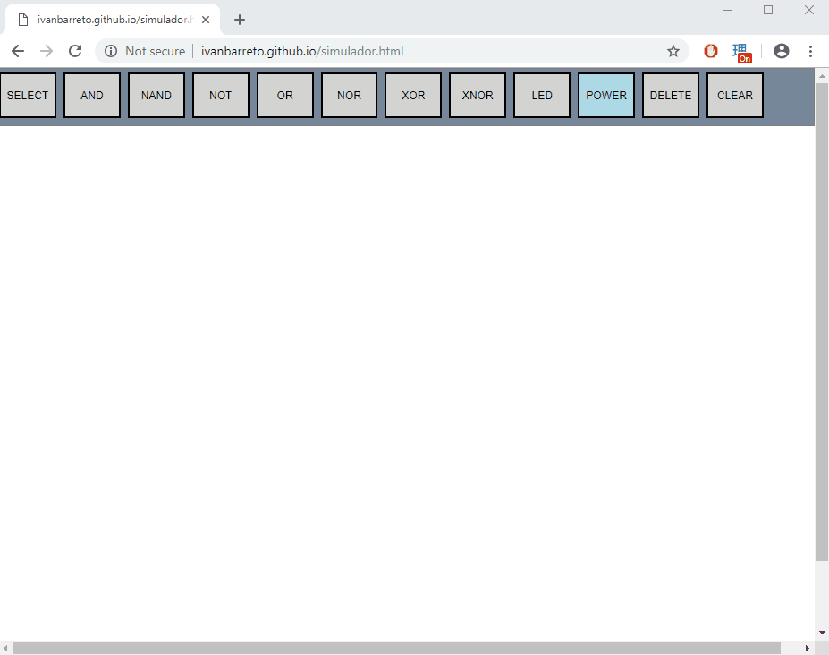
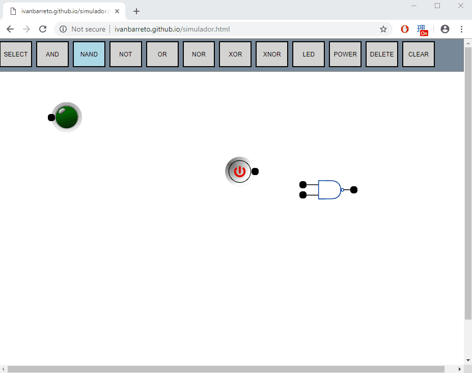
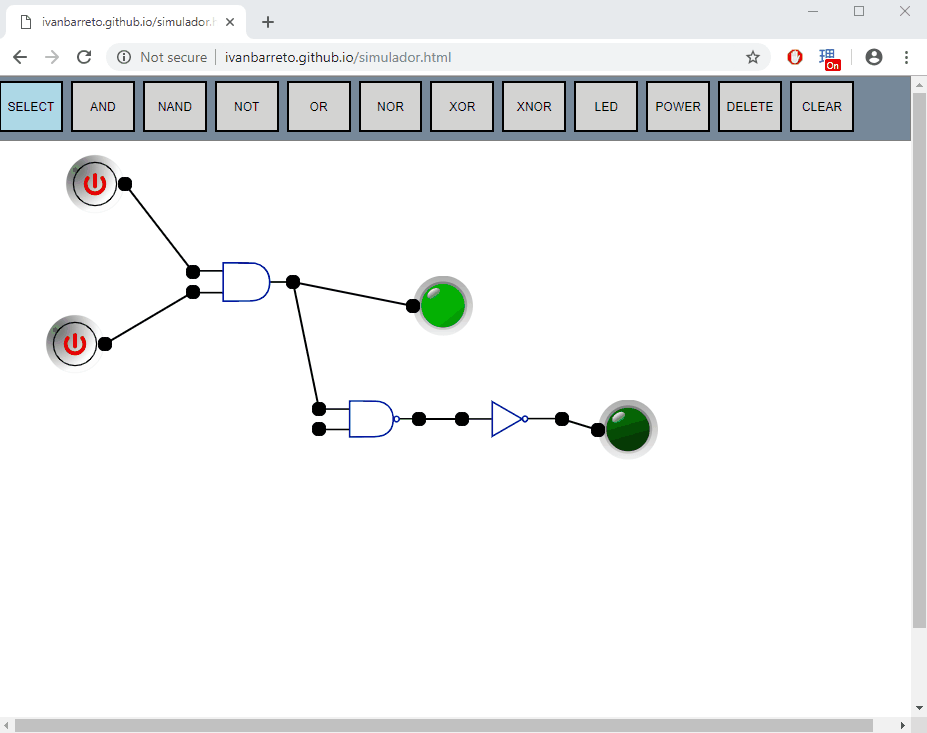
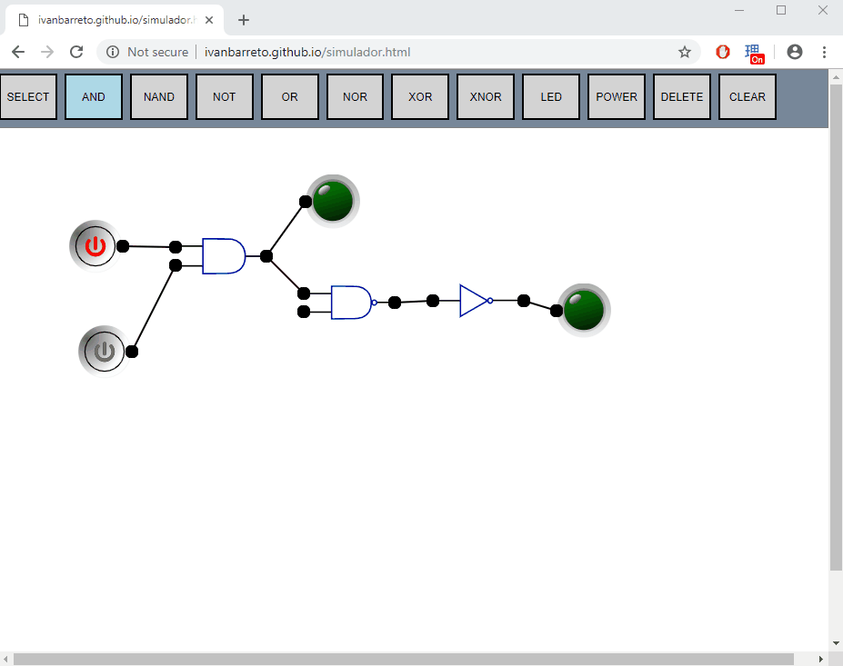
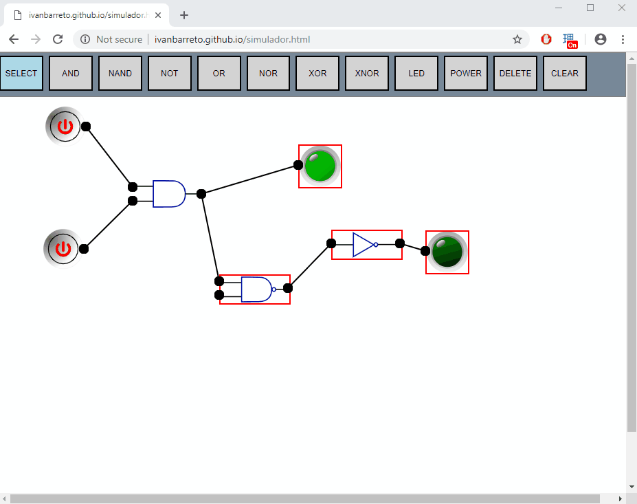
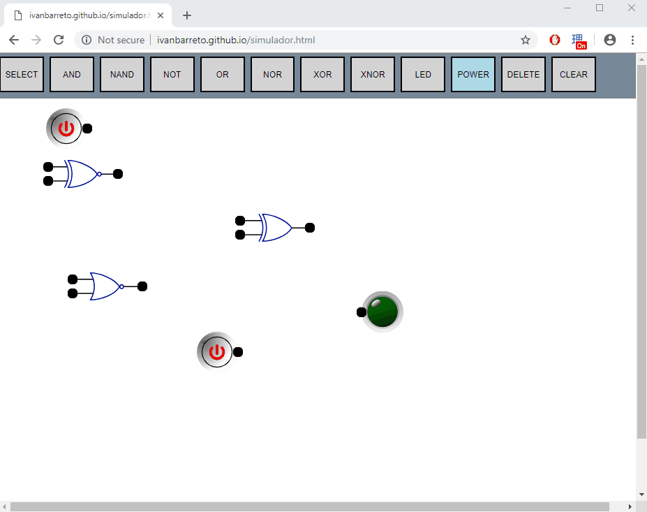

Digital circuits simulator can be accessed here:  
http://ivanbarreto.github.io/simulador.html  
How to use:  
Select the type of element you want to spawn on the menu;  
Click on the spot you want it to appear.  

The user can move and connect the elements by performing simple drag and drop operations;    The state of the POWER element can be changed by a simple click on top of it (on/off)  The LED element indicates if the result of the circuit is True or False.

By selecting the "select" button, the user can use a rubberband, just like in desktop applications to select multiple elements

It's possible to move nested objects if they were previously selected using the rubberband feature.

The same port can be connected to multiple elements.  The user can disconnect previously connected ports by performing simple, intuitive drag and drop operations

The user can delete selected elements by pressing the "delete" key or by clicking the "delete" button on the screen.

Alternatively, the user can click the "clear" button to remove all elements from the page:

Happy fiddling!
